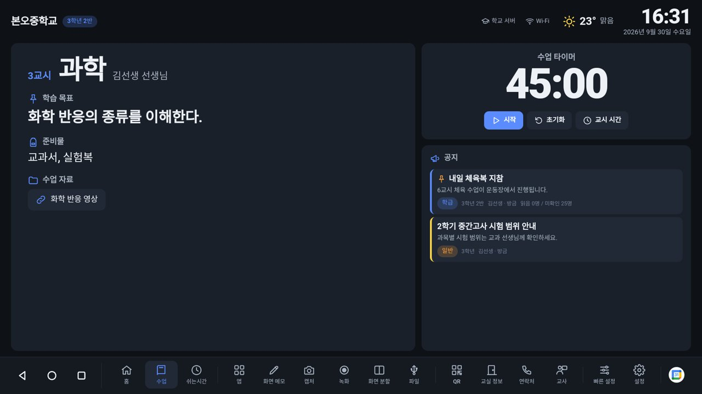
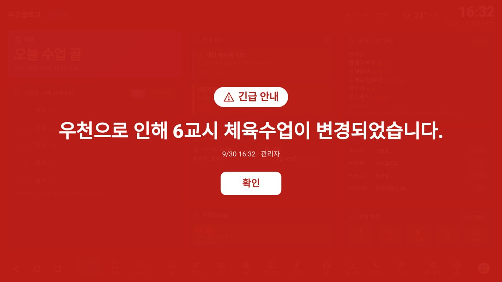
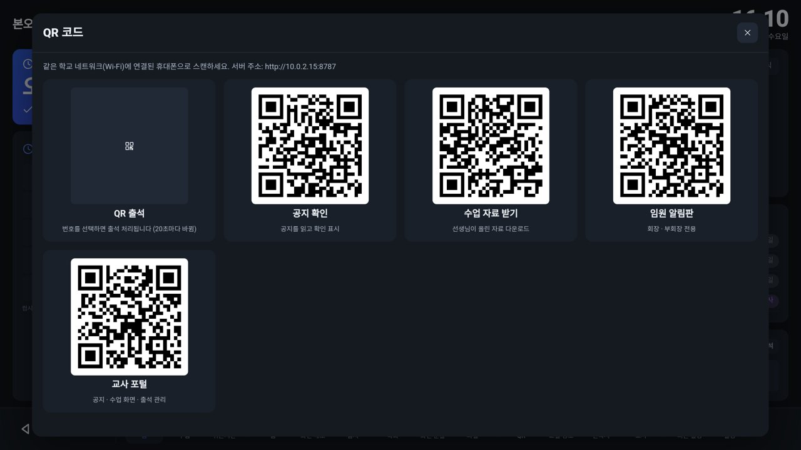
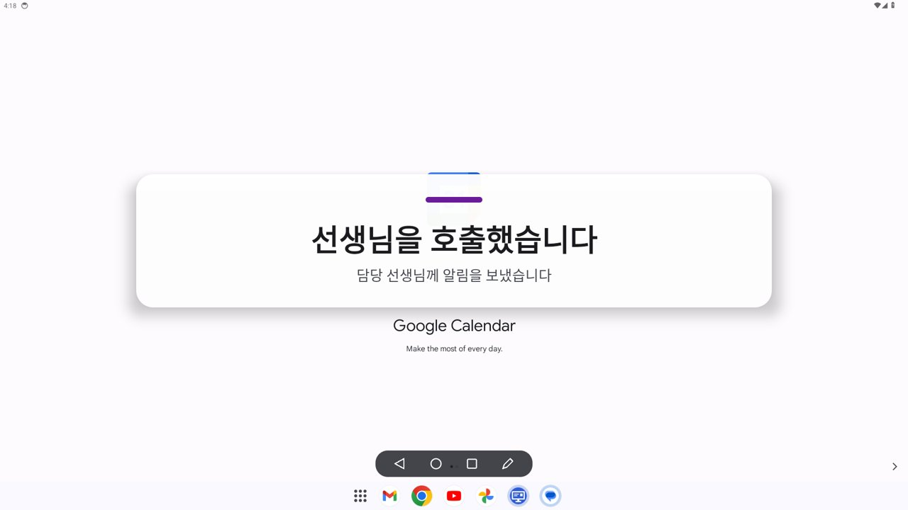
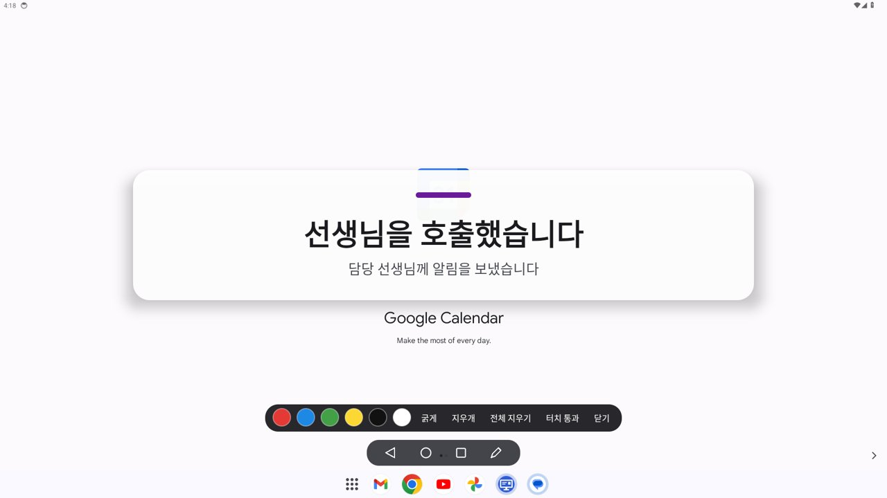
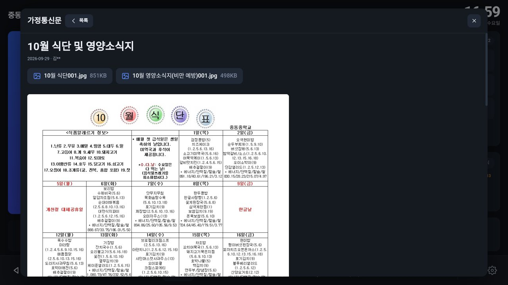
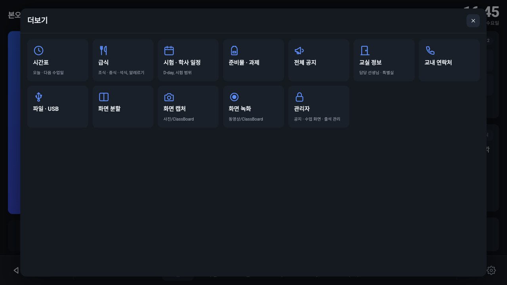
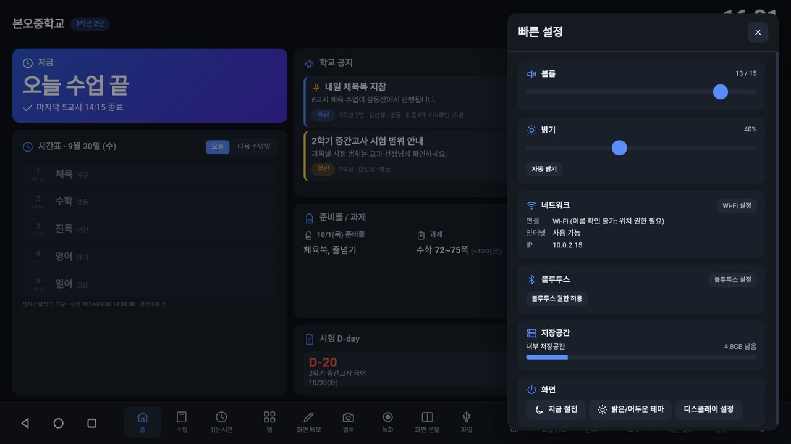

# 교실 OS (ClassBoard OS)

> **중동중학교(서울 강남구) 기준으로 설정되어 있습니다.** 처음 켜면 학교 검색 없이 중동중학교의 NEIS 급식 · 학사일정, 컴시간 시간표,
> 학교 홈페이지 가정통신문 · 공지사항 · 영양 소식, 학교 일과표(1교시 09:00 ~ 7교시 16:05, 아침 조회 · 점심시간), 날씨 위치가 바로 연결됩니다.
> 다른 학교에서 쓰려면 관리자 포털 `설정` 탭에서 학교를 다시 검색하면 됩니다.

학교 전자칠판용 안드로이드 홈 런처 겸 "학교 대시보드 OS"입니다.
컴시간 시간표, NEIS 급식·학사일정, 학교 공지, 긴급 알림, 임원 알림판, 출석, 오늘의 수업 화면을
전자칠판 한 대에서 보여 주고, 교내 네트워크만 있으면 인터넷이 끊겨도 알림이 동작합니다.

- 안드로이드 8.0(API 26) 이상 전자칠판 · 태블릿 · 키오스크 기기에서 동작
- 가짜 데이터나 시뮬레이션 없이 실제 데이터(컴시간, NEIS, Open-Meteo, 학교가 입력한 데이터)만 표시하고, 데이터가 없으면 빈 상태 안내를 보여 줍니다
- 외부 라이브러리 없이 안드로이드 SDK만 사용합니다 (UI는 WebView와 직접 만든 SVG 아이콘, QR 인코더 포함)

## 화면

아래 화면은 안드로이드 14 (1920×1080) 에뮬레이터에서 실제 컴시간 · NEIS · 날씨 데이터로 촬영했습니다.

| 메인 화면 | 오늘의 수업 |
|---|---|
|  |  |
| **긴급 알림** | **QR 코드 (출석 · 공지 · 자료 · 임원)** |
|  |  |
| **다른 앱 위 임원 알림 + 하단 탐색 버튼** | **다른 앱 위 화면 메모** |
|  |  |
| **가정통신문 (학교 홈페이지에서 자동 수집)** | |
|  | |
| **더보기 메뉴** | **빠른 설정** |
|  |  |

## 구성

```
[학교 서버(허브) 전자칠판] ── 교내 Wi-Fi / 유선 LAN ── [교실 전자칠판 1..N]
        │                                                │
        ├─ 계정 · 공지 · 긴급 알림 · 학급 데이터 보관          ├─ 허브 상태를 실시간 미러링 (롱 폴링)
        ├─ UDP 브로드캐스트로 자기 위치 알림                  ├─ 인터넷이 끊겨도 마지막 데이터 유지
        └─ 휴대폰 포털 제공 (http://허브IP:8787/m/)          └─ 긴급 · 임원 알림을 다른 앱 위에 표시
```

- 한 대를 **학교 서버(허브)**로, 나머지를 **교실 단말**로 설정합니다. 교실 단말은 같은 네트워크의 허브를 자동으로 찾습니다.
- 관리자와 학생은 휴대폰 브라우저로 포털에 접속합니다. 전자칠판의 QR 코드를 스캔하면 바로 열립니다. 별도 앱 설치가 필요 없습니다.
- 시간표와 급식은 각 전자칠판이 인터넷에서 직접 받아 캐시합니다.

## 기능

### 수업 · 학사 정보
| 기능 | 데이터 출처 |
|---|---|
| 오늘 · 다음 수업일 시간표, 현재 교시 · 다음 교시 자동 표시, 남은 시간 | 컴시간알리미 (10분마다 갱신), 컴시간 미등록 학교는 NEIS 시간표 |
| 시간표 변경 표시 (컴시간 변경 표시 포함) | 컴시간알리미 |
| 보강 · 대체 수업 · 교실 변경 · 휴강 | 교사가 포털에서 입력, 모든 칠판에 즉시 반영 |
| 교시 시작 시각 | 컴시간 일과시간 + 수업 시간(초 40 · 중 45 · 고 50분, 변경 가능) 또는 관리자가 직접 입력한 시종 시각 |
| 급식 (조식 · 중식 · 석식, 알레르기 번호와 이름, 칼로리) | NEIS 급식식단정보 |
| 학사 일정 (시험, 수행평가, 방학, 재량휴업일, 행사, 입학 · 졸업) | NEIS 학사일정 + 교사 입력 |
| 시험 정보 (시험 시간표, 과목, 범위, 준비물, D-day) | 교사 입력 + NEIS 학사일정의 고사 일정 |
| 날씨 · 미세먼지 | Open-Meteo (학교 위치는 OpenStreetMap으로 자동 검색) |
| 가정통신문 · 공지사항 (본문, 이미지, 첨부파일) | 학교 홈페이지 게시판 자동 수집 (서울 학교 홈페이지 `*.sen.ms.kr` · `*.sen.hs.kr` · `*.sen.es.kr` 등), 15분마다 갱신 |
| 기타 홈페이지 공지 | 게시판 RSS (관리자가 등록) |

### 공지 · 알림
- **가정통신문**: 학교 홈페이지의 가정통신문 · 가정통신문(교육청) · 공지사항 게시판을 자동으로 찾아 최신 글을 홈 화면 공지 칸과 "더보기 → 가정통신문"에 표시합니다. 글을 누르면 본문과 이미지가 칠판에 나오고, 첨부파일(PDF · 한글 · 이미지)은 뷰어 앱으로 바로 열립니다. 학생 휴대폰의 공지 페이지에서도 볼 수 있습니다.
- **학교 공지**: 학교 전체 · 학년별 · 반별, 긴급 · 일반 · 학급 공지 구분, 상단 고정, 게시 종료일
- **공지 읽음 처리**: 학생이 QR로 번호를 선택해 확인하고, 칠판과 포털에 "읽음 23명 / 미확인 5명" 표시
- **긴급 알림**: 관리자가 보내면 모든(또는 특정 학년) 전자칠판에 전체 화면 표시, 경보음 재생, 각 교실에서 "확인"을 누를 때까지 유지. 다른 앱을 쓰는 중이어도 위에 표시. 관리자는 어떤 칠판이 확인했는지 볼 수 있습니다.
- **임원 알림판** (학생 중 회장 · 부회장, PIN 필요): 조용히 해주세요 / 청소 시작 / 수업 준비 / 선생님 오세요 / 전달사항 있습니다
  - 칠판에 크게 표시, 짧은 알림음, 설정한 시간(기본 8초) 후 자동으로 사라짐
  - 누른 사람 이름은 칠판에 표시하지 않고 관리자만 기록 확인
  - 쿨다운, 10분 내 과다 사용 시 자동 10분 제한
  - 관리자가 버튼 사용 여부, 알림음, 표시 시간, 쿨다운을 설정
  - "선생님 오세요"는 관리자 포털을 열어 둔 휴대폰에 소리 · 진동으로 호출 알림

### 수업 화면
- **오늘의 수업**: 관리자가 포털에서 학급 · 날짜 · 교시별로 학습 목표, 준비물, 수업 자료(PDF · PPT · 한글 · 이미지 등), 링크, 타이머를 등록하면 해당 교시에 전자칠판에 자동으로 표시됩니다. "지금 칠판에 띄우기"로 즉시 표시할 수도 있습니다.
- **수업 시작 모드**: 수업 시간에는 과목, 선생님, 교실, 남은 시간, 학습 목표를 크게 표시
- **쉬는 시간 모드**: 다음 수업까지 카운트다운, 다음 과목 · 교실 · 준비물, 날씨 · 미세먼지, 공지
- **수업 타이머**: 교시 종료까지 카운트다운 또는 5 · 10 · 15분 / 수업 시간 타이머

### 학급 관리
- **출석**: 출석 · 결석 · 지각 · 조퇴, 학생별 상태, 오늘 현황, 담임이 바로 수정, QR 출석(20초마다 바뀌는 코드)
- **준비물 / 과제**: 관리자가 입력하면 칠판에 "내일 준비물", "과제"로 표시
- **교실 정보**: 현재 교실, 담당 선생님, 다음 수업 교실, 특별실 위치
- **교내 연락처**: 교무실 · 행정실 · 보건실 · 상담실 · 학년부 · 방송실 등 검색

### 전자칠판 시스템 기능
- **단순한 홈 화면**: 지금 수업(남은 시간 · 다음 수업), 오늘 시간표 한 줄, 공지 3개, 급식, 준비물 · 시험 D-day · 출석 타일만 표시하고, 나머지는 하단의 "더보기"에 모았습니다
- **16:9 화면 고정**: 가로 모드로 고정되고, 화면 비율이 16:9가 아닌 기기에서는 레터박스로 16:9 레이아웃을 유지합니다
- **안드로이드식 하단 버튼**: 뒤로 · 홈 · 최근 앱 버튼이 화면 하단 왼쪽에 있고, 다른 앱을 쓰는 중에는 같은 버튼(+ 화면 메모)이 떠 있는 막대로 표시됩니다 (뒤로 · 최근 앱은 접근성 서비스 필요)
- 기본 홈 앱(런처)으로 동작, 부팅 시 자동 실행
- 앱 런처, 최근 실행 앱, **화면 분할**(접근성 서비스 사용)
- **화면 위 메모**: 다른 앱 위에 펜으로 필기 (색상, 굵기, 지우개, 터치 통과)
- **화면 캡처** (사진/ClassBoard), **화면 녹화** (동영상/ClassBoard, 마이크 권한이 있으면 소리 포함)
- 밝기 · 자동 밝기 · 볼륨 조절, Wi-Fi 상태(SSID, 신호, 속도, IP), 블루투스 등록 기기 · 연결 상태, 저장공간, 배터리
- **USB 파일 관리자**: USB 폴더 탐색, 파일 열기, 수업 자료로 바로 올리기
- **자동 절전**: 일과 시간 외 화면 끄기(기기 관리자 권한 사용) 및 아침 자동 켜기, 주말 설정
- **수업 시작 시 앱 자동 실행**: 교시 · 요일별 규칙, 또는 수업 화면에 지정한 앱
- **수업 종료 후 자동 초기화**: 화면 메모 지우기, 열어 둔 자료 정리, 홈 화면으로 복귀

## 설치 및 처음 설정

1. [Releases](../../releases)에서 `ClassBoardOS.apk`를 받아 전자칠판에 설치합니다. (알 수 없는 출처 앱 설치 허용 필요)
2. **학교 서버로 쓸 한 대**에서 앱을 열고 `학교 서버 (허브)`를 선택 → 기기 이름과 학년 · 반 입력 → 관리자 이름과 PIN을 만들면 끝입니다. 중동중학교가 자동으로 연결됩니다.
3. **나머지 전자칠판**에서 `교실 단말`을 선택하면 같은 네트워크의 학교 서버가 목록에 나타납니다. 선택하고 학년 · 반을 입력합니다.
4. 각 칠판의 `설정` → `권한`에서 필요한 권한을 허용합니다.
   - 기본 홈 앱: 전원을 켜면 교실 OS가 바로 뜸
   - 다른 앱 위에 표시: 긴급 · 임원 알림, 화면 메모
   - 시스템 설정 변경: 밝기 조절
   - 접근성 서비스: 화면 분할
   - 기기 관리자: 자동 절전(화면 끄기)
5. 휴대폰으로 칠판의 `QR` → `관리자`를 스캔하거나 `http://허브IP:8787/m/`에 접속해 관리자 계정으로 로그인합니다. `설정` 탭에서 다른 선생님용 관리자 계정을 만들고, `학급` 탭에서 학생 명단과 임원을 등록합니다.

> 휴대폰이 학교 서버와 **같은 교내 네트워크**에 있어야 포털에 접속할 수 있습니다.

## 역할별 사용법

| 역할 | 접속 | 할 수 있는 일 |
|---|---|---|
| 관리자 | 포털 로그인 (이름 + PIN) | 수업 화면, 공지, 과제 · 일정(준비물 · 보강/대체 · 시험 · 학사 일정), 학급(출석 · 명단 · 임원), 긴급 알림, 설정(학교 · 계정 · 연락처 · 특별실 · 기기) |
| 학생 | 칠판 QR (계정 없음) | QR 출석, 공지 읽음 확인 |
| 학급 임원 | 칠판 QR `임원 알림판` (PIN) | 5가지 학급 알림 버튼 |

## 데이터 연동에 대해

- **컴시간알리미**: 공식 API가 없어 컴시간 웹 페이지(`http://comci.net:4082/st`)가 쓰는 데이터를 직접 읽습니다. `http://comci.net:4082/` 주소 자체는 원래 빈 페이지이며, 실제 시간표는 `/st` 경로에 있습니다. 학교망에서 4082 포트가 막혀 컴시간에 연결할 수 없으면 NEIS 시간표로 자동 전환합니다. 반별 시간표, 변경된 교시, 교시 시작 시각, 담임 선생님을 가져옵니다. 데이터의 키 이름이 바뀌어도 동작하도록 매번 컴시간 페이지의 스크립트에서 키 이름을 찾아냅니다. 컴시간 측 구조가 크게 바뀌면 동작하지 않을 수 있으며, 이 경우 오류가 칠판 설정 화면에 표시됩니다. 선생님 이름은 컴시간이 가려서 제공하는 경우(예: 김*정)가 있어 `학급 관리` → `교과 담당`에서 실제 이름을 지정할 수 있습니다.
- **e알리미**: e알리미(ealimi.com)는 공개 API를 제공하지 않아 직접 연동하지 않았습니다. 대신 학교 홈페이지의 가정통신문 · 공지사항 게시판을 직접 읽어 표시하고, 칠판 전용 공지는 관리자 포털에서 작성합니다. e알리미 측과 제휴 API가 확보되면 `DataFetcher`에 피드 형태로 추가할 수 있습니다.
- **NEIS 교육정보 개방 포털**: 배포 APK에는 인증키가 들어 있습니다. 인증키가 없으면 한 번에 5건까지만 받을 수 있어 앱이 기간을 나눠 여러 번 요청합니다. 관리자가 `설정`에 다른 키를 입력하면 그 키를 우선 사용합니다.
- **학교 홈페이지**: NEIS에 등록된 홈페이지 주소(또는 관리자가 `설정`에 입력한 주소)에서 게시판을 찾습니다. 서울 학교 홈페이지와 같은 교육청 통합 홈페이지 플랫폼을 지원하며, 경기도 등 다른 홈페이지 시스템을 쓰는 학교는 아직 자동 수집되지 않습니다(RSS가 있으면 RSS로 등록 가능).
- **날씨**: Open-Meteo(키 불필요), 학교 위치 검색은 OpenStreetMap Nominatim을 사용합니다.

## 보안

- PIN은 계정마다 다른 salt로 SHA-256 해시해 저장하고, 로그인 실패가 반복되면 5분간 차단합니다.
- 공개 상태(칠판과 휴대폰에 전달되는 데이터)에서는 PIN, 세션, 출석 기록, 학생 이름, 임원 버튼을 누른 사람을 제외합니다.
- 교실 단말은 허브에서 발급한 기기 키로 QR 출석 코드와 긴급 알림 확인을 처리합니다.
- 서버는 교내 네트워크용 HTTP(포트 8787)이며, 외부 인터넷에 포트를 열지 마세요.

## 직접 빌드하기

Gradle 없이 Android SDK 명령줄 도구만으로 빌드합니다.

필요한 것: JDK 17 이상, Android SDK (`platforms/android-34`, `build-tools` 34 이상), Python 3, Git Bash(Windows)

NEIS 인증키는 저장소에 올리지 않습니다. 빌드 전에 `secrets/neis.key` 파일에 키 한 줄을 넣어 두면 APK에 포함됩니다
(파일이 없으면 인증키 없이 빌드되고, 관리자 포털 `설정`에서 입력할 수 있습니다). 다른 데이터(컴시간, 날씨, 학교 홈페이지)는 키가 필요 없습니다.

```bash
mkdir -p secrets && echo "발급받은_NEIS_인증키" > secrets/neis.key
```

```bash
bash build.sh
```

결과물: `dist/ClassBoardOS.apk`. 처음 빌드할 때 `keystore/classboard.jks` 서명 키가 만들어집니다. 이 키는 저장소에 올리지 않으며, 같은 키로 서명해야 기존 설치 위에 업데이트할 수 있으니 따로 보관하세요.

## 폴더 구조

```
app/
  AndroidManifest.xml
  src/kr/classboard/os/
    MainActivity.java      전체 화면 WebView 홈 화면
    NativeBridge.java      앱 실행, 화면 분할, 밝기, 볼륨, Wi-Fi, 블루투스, 저장공간, USB 파일
    CoreService.java       상시 실행 서비스: 서버, 동기화, 교시 자동화, 절전, 알림 오버레이
    HttpServer.java        의존성 없는 HTTP 서버
    Router.java            정적 파일, 기기 API, 허브 API 또는 허브 프록시
    HubApi.java            학교 서버 API (계정, 공지, 긴급 알림, 임원, 출석, 파일 ...)
    SyncClient.java        허브 상태 미러링과 프록시
    LanBus.java            UDP 브로드캐스트로 허브 찾기
    Comcigan.java          컴시간알리미 시간표 파서
    Neis.java              NEIS 학교 검색, 급식, 학사일정, 시간표
    DataFetcher.java       외부 데이터 갱신과 캐시, 날씨, RSS
    Overlays.java          다른 앱 위 긴급 알림, 임원 알림, 화면 메모
    CaptureService.java    화면 캡처 · 녹화
    Chime.java             알림음 합성
  assets/web/
    board/                 전자칠판 화면
    m/                     휴대폰 포털
    shared/                SVG 아이콘, QR 코드 생성기, 공용 로직
build.sh                   APK 빌드 스크립트
```
