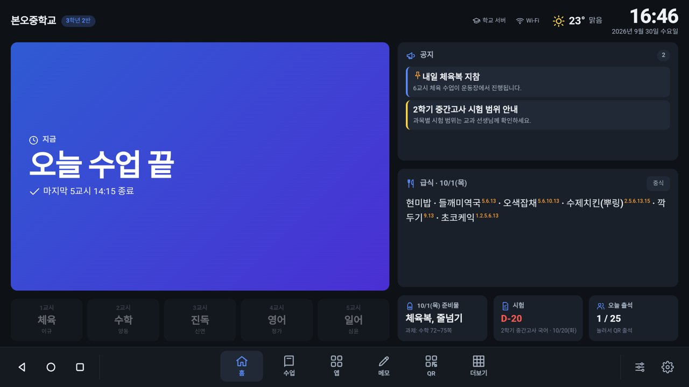
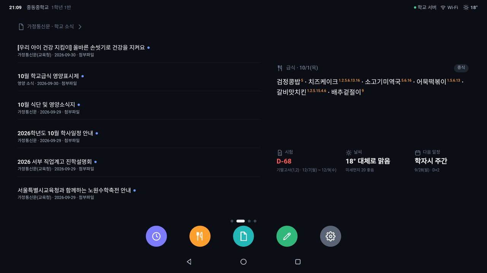
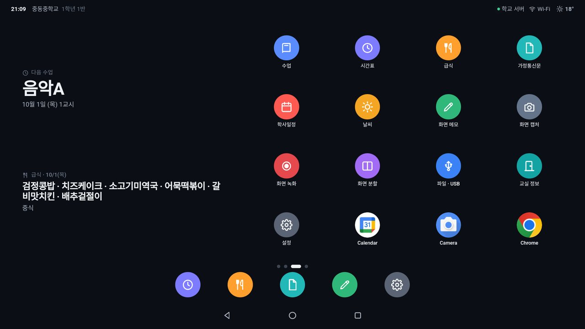
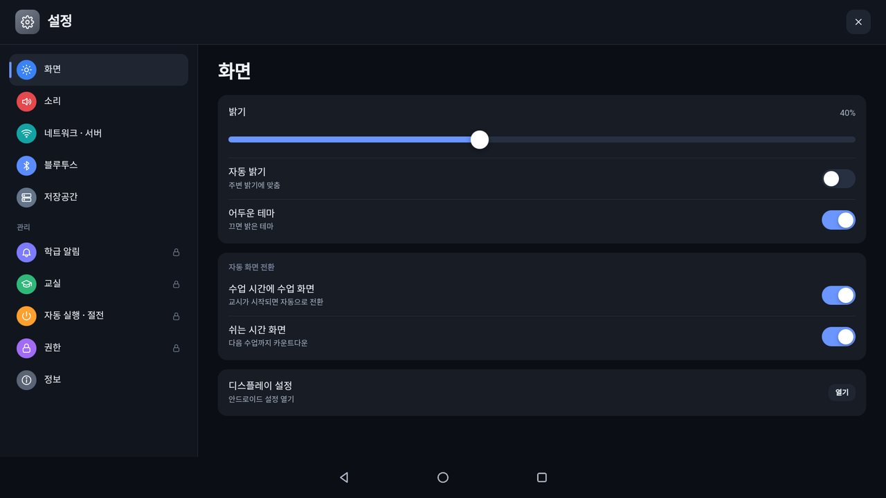
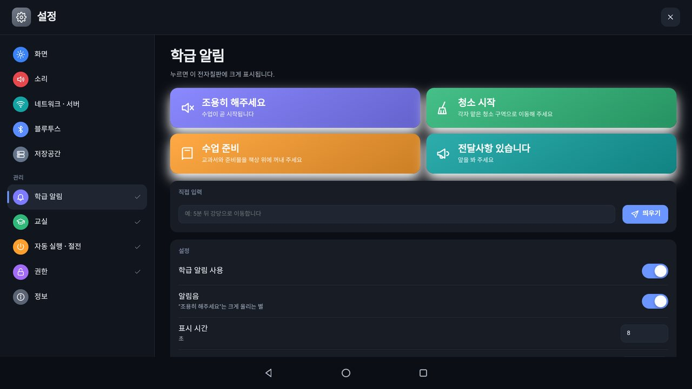
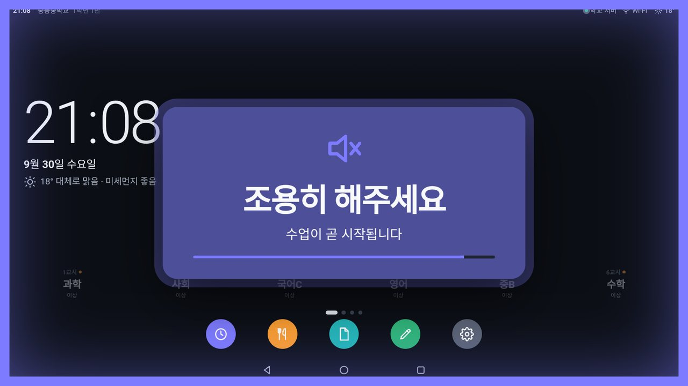

# 중동중학교 전자칠판

중동중학교(서울) 교실 전자칠판용 안드로이드 홈 런처입니다. 비공식 프로젝트입니다.

- **클라이언트** (`client/`): 전자칠판에 설치하는 APK입니다. 설치하면 앱 이름과 시작 화면이 **중동중학교**로 표시됩니다.
- **학교 서버** (`server/`): **`jdmsosserver.krl.kr`** 에서 24시간 돌아가는 데이터 서버입니다. 모든 전자칠판이 이 서버에서 시간표 · 급식 · 학사일정 · 가정통신문을 받아 옵니다.

휴대전화 포털이나 교사용 기능은 없습니다. 전자칠판에서만 보고 전자칠판에서만 조작합니다.
가짜 데이터나 시뮬레이션 없이 실제 데이터(컴시간, NEIS, 학교 홈페이지, Open-Meteo)만 표시하고, 데이터가 없으면 빈 상태를 그대로 안내합니다.

## 화면

안드로이드 14 (1920×1080) 에뮬레이터에서 실제 데이터로 촬영했습니다.

| 홈 1 · 지금 | 홈 2 · 학교 소식 |
|---|---|
|  |  |
| **홈 3 · 위젯과 앱** | **설정 앱** |
|  |  |
| **학급 알림 (설정 → 관리, PIN 필요)** | **조용히 해주세요 (알림음 + 깜빡임)** |
|  |  |

## 전자칠판 화면 구성

안드로이드 홈 화면처럼 동작합니다.

- **맨 위 상태 표시줄**: 시각, 학교 · 반, 학교 서버 연결 상태, Wi-Fi, 날씨
- **옆으로 넘기는 홈 페이지**
  1. 큰 시계 · 날짜 · 날씨, 지금 수업(남은 시간), 오늘 시간표
  2. 가정통신문 · 학교 소식, 급식, 시험 D-day · 날씨 · 다음 일정
  3. 이후 페이지: 위젯 2개 + 앱 16개씩 (학교 앱 다음에 설치된 안드로이드 앱)
- **하단 앱**: 기본은 시간표 · 급식 · 가정통신문 · 칠판 · 인터넷. 아이콘을 길게 눌러 넣고 빼거나, 설정 → 홈 화면에서 순서를 바꿀 수 있습니다 (최대 6개, 설치된 안드로이드 앱도 가능)
- **검색창**: 첫 페이지의 검색창을 누르면 브라우저가 열립니다 (네이버 · Google · 다음 중 선택)
- **맨 아래**: 안드로이드와 같은 ◁ 뒤로 · ○ 홈 · □ 최근 앱 버튼만 있습니다. 홈 화면에서 ○를 다시 누르면 첫 페이지로 돌아갑니다.
- 모든 기능은 앱 아이콘으로 열리고, 누른 아이콘에서 전체 화면 창이 커지며 열립니다.
- 수업이 시작되면 수업 화면(교시, 과목, 남은 시간, 타이머), 쉬는 시간에는 다음 수업까지 카운트다운으로 자동 전환됩니다.

### 앱

| 앱 | 내용 |
|---|---|
| 수업 · 시간표 | 컴시간알리미 시간표. 오늘은 크게, 내일은 작게, 이번 주는 표로. 교사 변경 · 시간표 변경 표시 |
| 급식 | NEIS 급식 (조식 · 중식 · 석식, 알레르기, 칼로리) |
| 가정통신문 | 학교 홈페이지(joongdong.sen.ms.kr)의 가정통신문 · 교육청 가정통신문 · 공지사항 · 영양 소식. 첨부된 PDF · HWP는 게시물 안에 바로 펼쳐 보여 주고, 크게 보기로 쪽을 넘겨 볼 수 있습니다 |
| 학사일정 | NEIS 학사일정, 시험 D-day (여러 날 시험은 기간으로 표시) |
| 날씨 | Open-Meteo 날씨 · 미세먼지 |
| 칠판 | 전체 화면 판서. 분필 색 5가지, 굵기, 지우개, 되돌리기, 칠판 · 흑판 · 화이트보드 · 모눈, 여러 페이지, 사진으로 저장 |
| 화면 메모 | 어떤 앱 위에서도 화면 전체에 판서. 펜 · 형광펜 · 지우개 · 되돌리기 · 터치 통과, 도구 막대는 끌어서 옮길 수 있습니다 |
| 화면 캡처 · 녹화 · 분할 | 화면 캡처 · 녹화, 두 앱 나란히 보기 |
| 인터넷 | 선택한 검색 엔진으로 브라우저 열기 |
| 학급 알림 | 조용히 해주세요 · 수업 준비 · 청소 시작 · 전달사항을 어떤 화면에서든 작은 창으로 바로 띄웁니다 (다른 앱 위의 탐색 막대에도 종 버튼). 수업 중에는 보낼 수 없습니다 |
| 파일 | 내부 저장공간(다운로드, 칠판 · 캡처, 화면 녹화, 문서, 사진)과 USB 메모리. 꽂으면 바로 나타나고, 사진은 미리보기, PDF · HWP는 전자칠판 안에서 열립니다 ("모든 파일 접근" 권한 필요) |
| 외부 입력 | 전자칠판의 HDMI 등 외부 입력으로 전환 (안드로이드 TV 입력을 지원하는 기기, 또는 제조사 입력 전환 앱) |
| 교실 정보 | 담임(컴시간), 지금 · 다음 수업, 학교 연락처 |
| 설정 | 아래 참고 |

### 설정 앱

| 구역 | 내용 | PIN |
|---|---|---|
| 화면 | 밝기, 자동 밝기, 어두운 테마, 수업 · 쉬는 시간 자동 화면 전환 | |
| 소리 | 미디어 볼륨, 알림음 미리 듣기 | |
| 네트워크 · 서버 | 학교 서버 연결 상태와 연결 확인, Wi-Fi 신호 | |
| 블루투스 · 저장공간 | 연결된 기기, 저장공간 사용량 | |
| 학급 알림 | 조용히 해주세요 · 청소 시작 · 수업 준비 · 전달사항, 직접 입력 문구. 표시 시간, 알림음, 연속 누름 방지 | 필요 |
| 교실 | 학년 · 반, 기기 이름, 설치 PIN 변경, 서버 주소(시험용) | 필요 |
| 자동 실행 · 절전 | 일과 외 화면 끄기, 수업 종료 시 초기화, 교시별 자동 실행 앱 | 필요 |
| 권한 | 기본 홈 앱, 다른 앱 위 표시, 접근성, 기기 관리자 등 | 필요 |
| 정보 | 버전, 데이터 갱신 시각 · 오류, 새로고침 | |

PIN은 처음 켤 때 정하고, 한 번 입력하면 5분 동안 유지됩니다.

**홈 화면** 구역(PIN 없음)에서 하단 앱, 검색 엔진, 저사양 모드, **수업 시작 전 알림**(켜기 · 몇 분 전 · 알림음)을 정합니다. 수업이 끝날 때는 알리지 않고, 쓰던 앱을 닫지도 않습니다 (설정 → 자동 실행에서 켤 수 있음).

### 저사양 전자칠판

- 데이터 수집과 가공(컴시간 · NEIS · 학교 홈페이지 파싱, 학사일정 정리, 최신 소식 정렬)은 모두 학교 서버가 합니다. 전자칠판은 학교 전체 데이터를 받아 화면에 그리기만 합니다.
- 전자칠판은 1분마다 서버에 "바뀐 것이 있는지"만 물어봅니다. 바뀌지 않았으면 응답은 수십 바이트입니다.
- 학교 서버가 30분 넘게 연결되지 않을 때만 전자칠판이 직접 받아 오며, 그것도 3시간에 한 번입니다.
- 저사양 모드(메모리가 적거나 코어가 4개 이하이면 자동)에서는 애니메이션과 그림자를 끕니다. 화면은 1분에 한 번만 다시 그리고, 초 단위로 바뀌는 것은 남은 시간뿐입니다.
- 4GB 메모리 · 4코어 기준으로 홈 화면에 둘 때 CPU 사용률은 1% 미만입니다.
- 게시물 본문은 서버가 최근 글을 미리 받아 둡니다. 서버가 2.5초 안에 답하지 않으면 전자칠판이 직접 받아 오고, 한 번 연 글은 기기에 저장해 바로 열립니다.

## 구조

```
                 인터넷 (컴시간 · NEIS · 학교 홈페이지 · Open-Meteo)
                                │
                  ┌─────────────┴─────────────┐
                  │  학교 서버 (server/)        │  jdmsosserver.krl.kr, 24시간
                  │  1분마다 데이터 수집 · 보관   │
                  └─────────────┬─────────────┘
                                │ HTTPS (/api/state 롱 폴링, /api/shared)
        ┌───────────────────────┼───────────────────────┐
   [전자칠판 1-1]           [전자칠판 1-2]    ...    [전자칠판 3-10]
   client/ APK: 127.0.0.1:8787 에서 화면(WebView)과 기기 기능 제공
```

- 전자칠판은 학교 서버의 데이터를 받아 기기에 저장합니다. 서버에 연결되지 않으면 인터넷에서 직접 받아 오고, 인터넷도 끊기면 마지막 데이터를 보여 줍니다.
- 전자칠판 안의 웹 서버는 `127.0.0.1`에만 열려 있어 다른 기기에서 접근할 수 없습니다.
- NEIS 인증키는 **서버에만** 있습니다. APK에는 어떤 키도 들어 있지 않습니다.

## 학교 서버 설치 (jdmsosserver.krl.kr)

서버에는 Java 17 이상 또는 Docker가 필요합니다.

1. **DNS**: `jdmsosserver.krl.kr`의 A 레코드를 서버 공인 IP로 지정합니다.
2. **NEIS 인증키**: `server/.env` 파일을 만들고 키를 적습니다. 이 파일은 저장소에 올리지 않습니다.
   ```
   NEIS_KEY=발급받은_인증키
   STATUS_KEY=상태페이지_비밀번호(선택)
   ```
3. **실행 (Docker, 권장)**: 재부팅이나 오류가 나도 자동으로 다시 시작합니다.
   ```bash
   cd server && docker compose up -d --build
   ```
   Docker 없이 실행하려면 `bash server/build.sh`로 `server/dist/jdms-server.jar`를 만들고 `server/jdms-server.service`(systemd)를 사용합니다.
4. **HTTPS**: [Caddy](https://caddyserver.com)에 `server/Caddyfile`을 쓰면 인증서가 자동으로 발급됩니다.
   ```bash
   caddy run --config server/Caddyfile
   ```
5. 브라우저에서 `https://jdmsosserver.krl.kr/` 을 열면 상태 페이지(데이터 갱신 시각, 오류, 연결된 전자칠판 목록)가 보입니다. `STATUS_KEY`를 정해 두면 전자칠판마다 **연결 해제** 버튼이 생깁니다. 해제한 칠판은 서버에서 데이터를 받지 못하고 화면에 "서버에서 연결 해제됨"으로 나오며, 아래 목록에서 **다시 허용**할 수 있습니다.

| 환경 변수 | 기본값 | 설명 |
|---|---|---|
| `PORT` | 8080 | 서버 포트 |
| `DATA_DIR` | `data` | 데이터 저장 폴더 (Docker는 `/data`) |
| `NEIS_KEY` | (없음) | NEIS 인증키. 없으면 `secrets/neis.key`를 읽고, 그것도 없으면 키 없이 요청합니다 |
| `STATUS_KEY` | (없음) | 정하면 상태 페이지에 `?key=` 가 필요합니다 |

**첨부파일 변환**: PDF는 서버가 쪽 그림으로 바꿔 보냅니다. HWP · 오피스 문서는 LibreOffice로 PDF로 바꾼 뒤 같은 방식으로 보냅니다. Docker 이미지에는 LibreOffice와 한글 글꼴이 들어 있고, Docker 없이 리눅스에서 root로 실행하면 서버가 LibreOffice를 apt · dnf로 자동 설치합니다 (`AUTO_INSTALL_OFFICE=0`이면 하지 않음). HWP 변환 확장(H2Orestart)도 처음 시작할 때 자동으로 설치합니다. 진행 상태는 상태 페이지에 나옵니다. 서버에 연결되지 않으면 전자칠판이 PDF만 직접 그립니다.

서버 API: `/api/ping`, `/api/state` (롱 폴링), `/api/shared` (시간표 · 급식 · 학사일정 · 날씨 · 홈페이지), `/api/device/hello`, `/api/homepage/detail`

## 전자칠판 설치

1. [Releases](https://github.com/3289david/classboard-os/releases)에서 `ClassBoardOS.apk`를 받아 설치합니다.
2. 처음 켜면 학년 · 반과 설치 PIN을 정합니다. 학교 서버 주소(`jdmsosserver.krl.kr`)는 앱에 들어 있어 입력할 필요가 없습니다.
3. 홈 버튼을 누르고 **중동중학교**를 기본 홈 앱으로 고르면, 전원을 켤 때마다 바로 이 화면이 뜹니다.
4. 설정 앱 → 권한에서 필요한 권한을 허용합니다.

## 빌드

Gradle 없이 Android SDK 명령줄 도구만 씁니다 (build-tools, platform android-34, JDK 17 이상).

```bash
bash client/build.sh
```

`dist/ClassBoardOS.apk`가 만들어집니다. 서명 키는 `keystore/classboard.jks`에 처음 한 번 만들어지며, 저장소에 올리지 않습니다. 같은 키로 서명해야 업데이트 설치가 되므로 잘 보관하세요.

```bash
bash server/build.sh
```

`server/dist/jdms-server.jar`가 만들어집니다.

### 에뮬레이터에서 로컬 서버로 시험하기

```bash
PORT=8080 java -jar server/dist/jdms-server.jar
```

에뮬레이터의 설정 앱 → 교실 → 학교 서버 주소에 `http://10.0.2.2:8080`을 넣으면 PC에서 돌린 서버에 연결됩니다. 비워 두면 다시 `jdmsosserver.krl.kr`을 씁니다.

## 폴더

```
client/   전자칠판 APK (AndroidManifest, Java 소스, 리소스, 웹 화면 assets/web)
server/   학교 서버 (Java 소스, Dockerfile, docker-compose.yml, Caddyfile, systemd 유닛)
docs/     스크린샷
```
